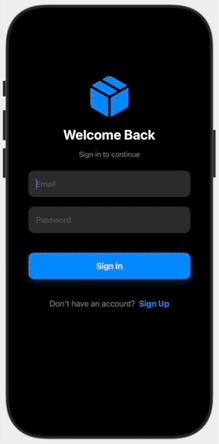

# Quickie delivery app 📱

> **Note**: 🔒 This is a portfolio project. The source code is kept private to protect intellectual property rights. This README serves as a comprehensive overview of the project's features and technical implementation.

## 📱 Overview

A modern SwiftUI-based hyperlocal delivery application that provides a seamless experience for ordering and tracking deliveries in real-time. Built with the latest Apple technologies and following best practices in iOS development.
### 📱 App Demo

---

## ✨ Key Features

### 🛍️ Shopping Experience
- **Smart Browsing**: Products organized by sections (Electronics, Groceries, Food)
- **Intelligent Filtering**: Category-based filtering within each section
- **Live Search**: Real-time search functionality
- **Cart Management**: Intuitive cart interface with live updates
- **Rich Product Cards**: Beautiful UI with high-quality images and detailed information

### 🚚 Delivery Options
- **Multiple Methods**:
  - ⚡ Express Delivery
  - 🌱 Eco-Friendly Electric Vehicle
  - 🚲 Bicycle Delivery (short distances)
  - 📦 Standard Delivery
- **Smart Scheduling**: 
  - 🕒 Time slot selection with traffic predictions
  - 💰 Dynamic pricing based on delivery times
  - 🏷️ Special off-peak discounts

### 📍 Order Tracking
- **Live Updates**: 
  - 🗺️ Real-time map tracking
  - 🚗 Live delivery personnel location
  - ⏱️ Dynamic ETA calculations
  - 🛣️ Visual route display
  - 📌 Location markers

### 💳 Checkout Process
- 💳 Multiple payment methods
- 📍 Smart address management
- 📝 Custom delivery instructions
- 📋 Detailed order summary

### 🌟 Social Features
- ⭐ Delivery reviews and ratings
- 📸 Photo review attachments
- 🏷️ Quick feedback tags
- 🔐 Privacy options
- 🏆 Achievement system

### 🎮 Gamification
- 🎯 Engaging delivery challenges
- 💎 Points rewards system
- 🏅 Achievement badges
- 🎁 Challenge-based discounts

### 🌍 Sustainability
- 🌱 Carbon footprint tracking
- ♻️ Eco-friendly delivery options
- 🌿 Green milestones
- 🌎 Environmental impact metrics

---

## 🛠 Technical Stack

### Requirements

### Core Frameworks
- 📱 SwiftUI
- 🗺️ MapKit
- 📍 CoreLocation
- 📸 PhotosUI
- 🔄 Combine

### Architecture & Patterns
- 🏗️ MVVM Architecture
- 🧩 Protocol-Oriented Programming
- 🔄 Reactive Programming (Combine)
- ⚡ Actor-Based Concurrency

### Key Components
- 📐 Custom SwiftUI Layouts
- ⚡ Async/Await Operations
- 💉 Environment-Based DI
- 🎨 Custom View Modifiers
- 🧱 Reusable UI Components

---

## 📱 Project Status

This is a private project showcasing modern iOS development practices:
- 🎨 SwiftUI for the frontend
- 🏗️ MVVM architecture
- ⚡ Actor-based concurrency
- 📐 Custom layouts and components

While the source code is private, I'm happy to discuss technical details and implementation approaches. Feel free to reach out!

---

## 📄 License

This project and its source code are proprietary and not available for public use or distribution.

## 🙏 Acknowledgments

- 🍎 Apple's SwiftUI framework
- 🗺️ MapKit for location services
- 👥 SwiftUI community

---

## 📫 Contact

Let's connect! Reach out for project inquiries or collaboration opportunities: 

